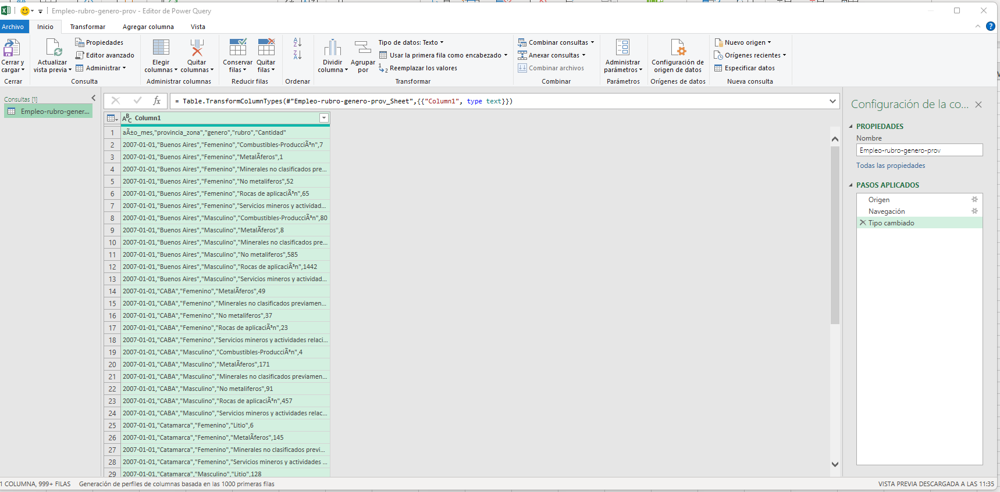
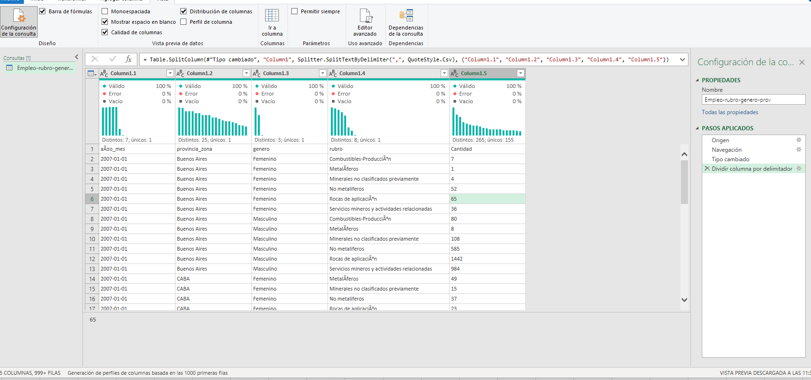
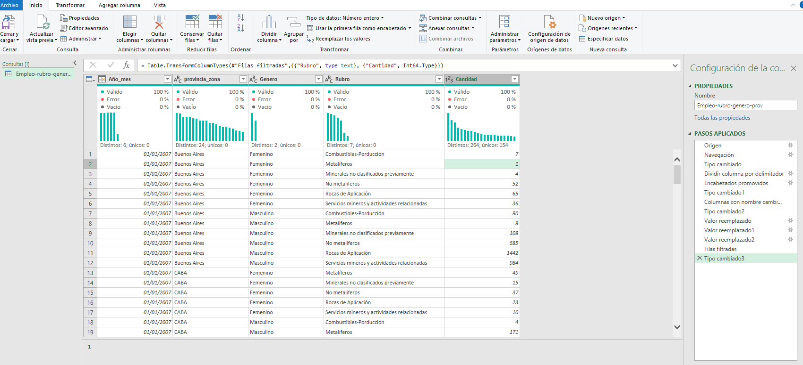
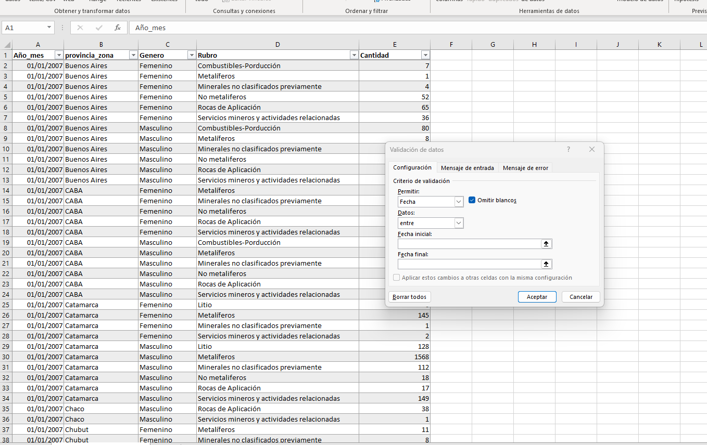

# Limpieza y Transformación de Datos del Empleo Minero (SIACAM)

## Descripción

Proyecto de limpieza y preparación de datos utilizando **Excel** y **Power Query** sobre el dataset público del Sistema de Información Abierta a la Comunidad sobre la Actividad Minera en Argentina (SIACAM).

## Objetivo

Preparar un conjunto de datos para futuras etapas de análisis mediante la corrección de problemas estructurales, validación de datos y estandarización de variables.

## Dataset

- **Fuente:** datos.gob.ar
- **Organismo:** Secretaría de Minería
- **Registros:** 46.367
- **Variables:** Año/Mes, Provincia, Género, Rubro y Cantidad de puestos de trabajo.

---

# Herramientas utilizadas

- Microsoft Excel
- Power Query

---

# Problemas encontrados

Durante el diagnóstico inicial se identificaron los siguientes problemas:

- El archivo fue importado en una única columna.
- Existían errores de codificación de caracteres (encoding).
- Los encabezados no estaban configurados correctamente.
- Los tipos de datos no eran los adecuados para cada variable.

---

# Proceso de limpieza y transformación

### 1. Importación del dataset

Se importó el archivo CSV en Power Query. Inicialmente todos los registros se encontraban en una única columna, impidiendo interpretar correctamente la estructura del dataset.

---

### 2. Separación de columnas y validación inicial

La información fue dividida utilizando la coma (`,`) como delimitador. Posteriormente se utilizaron las herramientas de **Calidad de columnas** y **Distribución de columnas** para verificar la existencia de valores nulos, errores o registros vacíos.

Esta revisión permitió comprobar que el dataset no presentaba valores nulos ni errores de calidad.

---

### 3. Corrección y estandarización

Se promovió la primera fila como encabezado, se corrigieron los nombres de las columnas, se solucionaron los problemas de encoding y se asignó el tipo de dato correspondiente a cada variable.

---

### 4. Validación final

Finalmente, el conjunto de datos fue cargado nuevamente en Excel como una tabla estructurada y se verificó que las columnas correspondientes a la fecha y la cantidad de puestos de trabajo fueran interpretadas correctamente.

---

# Transformaciones realizadas

- División de columnas por delimitador.
- Promoción de encabezados.
- Corrección de nombres de columnas.
- Corrección de caracteres (encoding).
- Asignación de tipos de datos.
- Validación de calidad de los datos.
- Validación final en Excel.

---

# Resultado

Se obtuvo un dataset limpio, estructurado y listo para futuras etapas de análisis, consultas SQL o construcción de dashboards.

---
